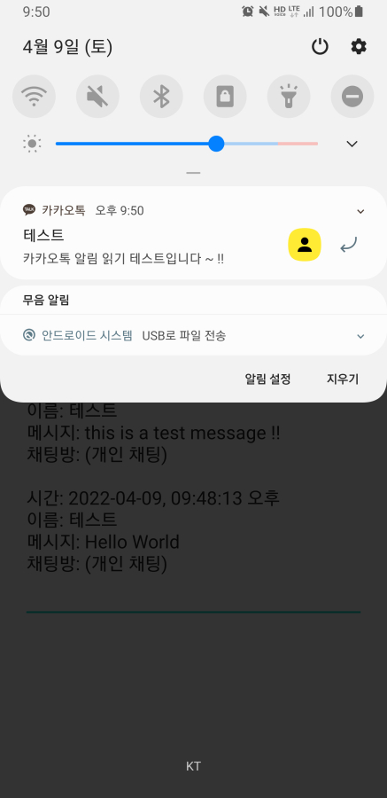
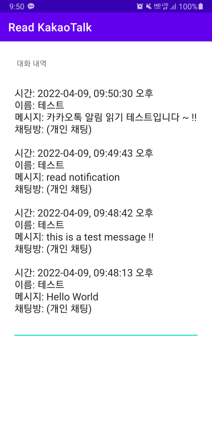
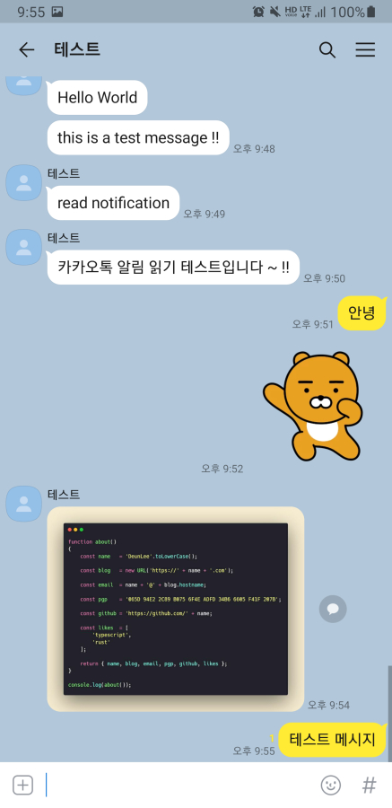
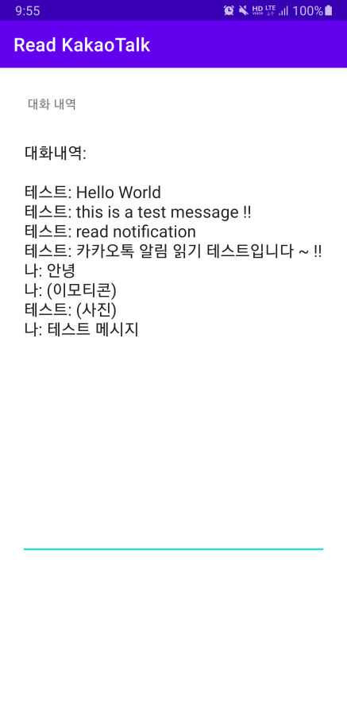

# 카카오톡 대화 가져오기
## Read the KakaoTalk message on Android
- NotificationListenerService Example Code
- AccessibilityService Example Code

안드로이드에서 카카오톡 대화 내용을 가져오는 앱입니다.

## 동작 원리:
카카오톡은 사용자의 대화 내용을 제공하는 API가 없으므로 안드로이드 시스템 API를 이용합니다.

### 1. [NotificationListenerService](https://developer.android.com/reference/android/service/notification/NotificationListenerService)
알림 리스너 서비스를 이용해 카카오톡 알림창이 뜨면 해당 내용을 가져옵니다.
보낸 사람, 메시지, 방 이름을 가져올 수 있습니다.
하지만 카카오톡 채팅방이 포그라운드 상태일 경우 해당 사용자의 대화 내용은 알림에 표시되지 않으므로 가져올 수 없는 문제가 있습니다.

Android Notification           | Read-KakaoTalk App
:-----------------------------:|:------------------------------:
 | 

### 2. [AccessibilityService](https://developer.android.com/reference/android/accessibilityservice/AccessibilityService)
카카오톡 채팅방이 포그라운드 상태일 경우 접근성 서비스를 이용해 화면 내용을 가져옵니다.
보낸 사람, 메시지를 가져올 수 있지만, 방 이름은 가져올 수 없습니다. (TODO?)
스크롤하거나 새로운 메시지가 도착한 경우 이벤트를 받아 메시지를 가져옵니다.

KakaoTalk Screen                | Read-KakaoTalk App
:------------------------------:|:-------------------------------:
 | 
